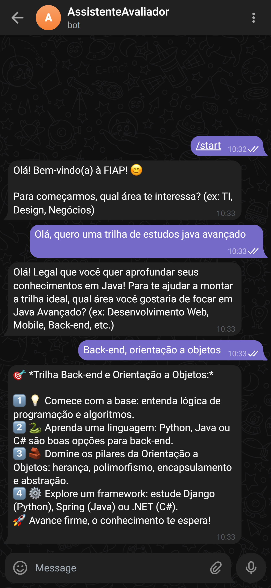
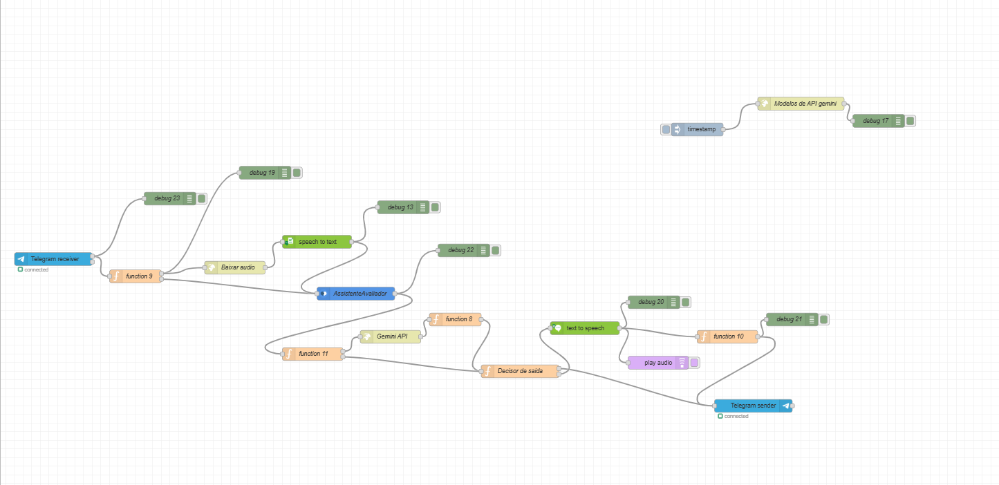

# SkillUp - AI Learning Path Orchestrator

  
  
  
  

[**English**](#english) | [**Português**](#portugues)

---

## English

### Project Overview
SkillUp is a hybrid AI assistant designed to generate personalized learning paths. It acts as an educational mentor that maps the user's current knowledge and suggests a logical roadmap to master new skills in IT, Design, or Business.

### 🛠 Technologies & Skills
* **AI & NLP:** Google Gemini API, IBM Watson Assistant.
* **Backend & Integration:** Node-RED (Low-code orchestration), API REST integration.
* **Interface & Voice:** Telegram Bot API, STT (Speech-to-Text), TTS (Text-to-Speech).
* **Data Handling:** JSON, Environment Variables, Logic Flows.

  
  
<i>The assistant in action generating learning paths</i>

### Technical Architecture
The core of this project is API Orchestration. Instead of a single script, it integrates multiple world-class services:
* **IBM Watson Assistant:** Manages conversation flow, user intent, and session context.
* **Google Gemini API:** Acts as the generative brain to create dynamic, real-time study roadmaps.
* **Node-RED:** The integration hub (Low-code/Code) that connects all APIs and handles logic.
* **Telegram Bot API:** The user interface for real-time interaction.
* **STT/TTS:** Speech-to-Text and Text-to-Speech implementation for voice commands.

  
  
<i>Full orchestration workflow in Node-RED</i>

### Key Features
* **Profile Identification:** The bot segments users by area of interest.
* **Adaptive Roadmap:** Generates step-by-step guides from beginner to advanced levels.
* **Voice Interaction:** Supports audio messages for better accessibility.

### Getting Started / How to Run
To run this project locally, you will need:
1. Node-RED installed and running.
2. API Keys for Google Gemini, IBM Watson (Assistant, STT, TTS), and a Telegram Bot Token.

**Steps:**
1. Clone this repository.
2. Open Node-RED and go to Menu > Import. Select the `flows/flows node-red.json` file.
3. Import the `flows/CR7-dialog.json` into your IBM Watson Assistant environment.
4. **Important:** Replace all placeholder strings inside the Node-RED nodes with your actual API keys.
5. Deploy the flow and interact with your bot on Telegram.

---

## Português

### Sobre o Projeto
O SkillUp é um assistente de IA híbrido desenvolvido para criar trilhas de aprendizado personalizadas. Ele funciona como um mentor educacional que mapeia o conhecimento do usuário e sugere um roteiro lógico para dominar novas habilidades.

### 🛠 Tecnologias e Habilidades
* **IA e NLP:** Google Gemini API, IBM Watson Assistant.
* **Backend e Integração:** Node-RED (Orquestração low-code), Integração de APIs REST.
* **Interface e Voz:** Telegram Bot API, STT (Voz para Texto), TTS (Texto para Voz).
* **Manipulação de Dados:** JSON, Variáveis de Ambiente, Fluxos Lógicos.

### Arquitetura Técnica
O diferencial deste projeto é a Orquestração de APIs. Ele integra diversos serviços de ponta:
* **IBM Watson Assistant:** Gerencia o fluxo da conversa, intenções e o contexto da sessão.
* **Google Gemini API:** Funciona como o cérebro generativo para criar roteiros dinâmicos em tempo real.
* **Node-RED:** O hub de integração que conecta todas as APIs e gerencia a lógica de dados.
* **Telegram Bot API:** A interface de interação direta com o usuário.
* **STT/TTS:** Implementação de áudio (Voz para Texto e Texto para Voz).

### Funcionalidades Principais
* **Identificação de Perfil:** Segmentação automática entre TI, Design ou Negócios.
* **Trilhas Adaptativas:** Sugestões lógicas de estudo do Iniciante ao Avançado.
* **Interação por Voz:** Suporte para comandos de voz e respostas sintetizadas.

### Como Executar
Para rodar este projeto na sua máquina, você vai precisar de:
1. Node-RED instalado e rodando.
2. Chaves de API do Google Gemini, IBM Watson (Assistant, STT, TTS) e um Token de um bot no Telegram.

**Passo a Passo:**
1. Faça o clone deste repositório.
2. Abra o Node-RED, vá em Menu > Importar e selecione o arquivo `flows/flows node-red.json`.
3. Importe o arquivo `flows/CR7-dialog.json` no seu ambiente do IBM Watson Assistant.
4. **Importante:** Substitua todos os textos de placeholders com chaves dentro dos nós do Node-RED pelas suas chaves de API reais.
5. Clique em Deploy e mande uma mensagem para o seu bot no Telegram.

---

### Repository Structure / Estrutura
* **/flows:** Contém arquivos .json para Node-RED e Watson Assistant.
* **/docs:** Relatórios técnicos e diagramas de arquitetura.

---

**Developed by Gabriel Correa Souza** *Project created for AI & Chatbot discipline at FIAP.*

---
